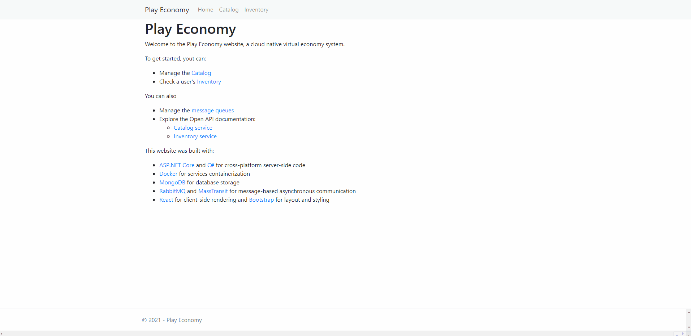

# GameStore 🎮

###### Projeto de introdução ao .NET Microservices construído junto as aulas do Julio Casal <FreeCodeCamp.org>

#### Tecnologias
- .NET 6
- MongoDB
- Docker
- RabbitMQ
- MassTransit

#### Patterns
- Circuit Breaker
- Generic repository Pattern
- Retries with exponential backoff
- Reusability with nuget

[Clique aqui para ver o curso](https://www.youtube.com/watch?v=CqCDOosvZIk)